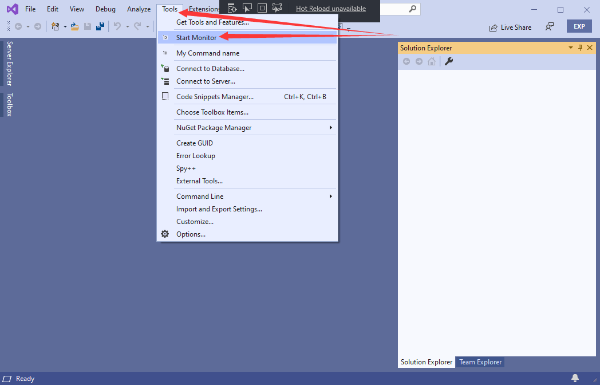
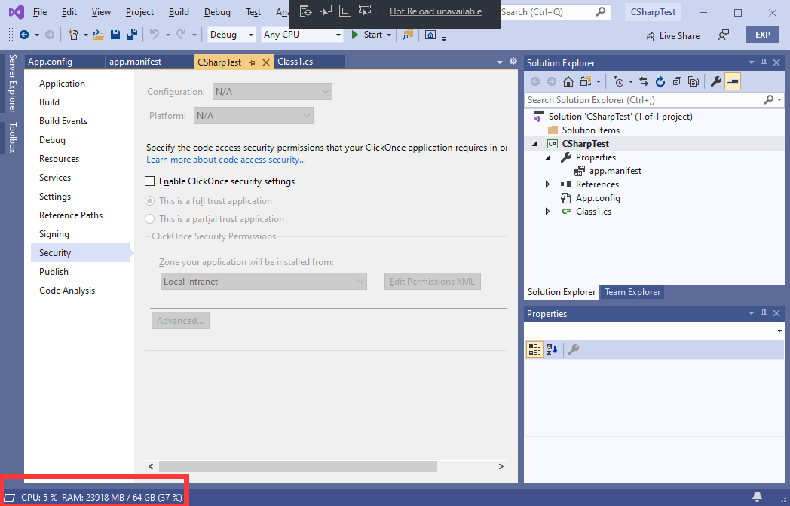

# ResourceMonitor
A Visual Studio extension for monitoring CPU and RAM usage.
## Download
[Visual Studio Marketplace](https://marketplace.visualstudio.com/items?itemName=HO-COOH.ResourceMonitor)
## Usage
~~1. ``Tools`` -> ``Start Monitor``~~ No need. It automatically loads now :)

1. Now it will appear in the status bar.

## Plans
- Add a setting menus for changing the refresh speed.
- Add settings for displaying different things.
- ~~Able to run on start up~~ √ (add a setting option for this too).

### Note:
Partially inspired by:
- https://github.com/lkytal/StatusInfo (RIP, not supporting VS2019)

*Visual studio are you drunk for occupying such precious screen-sapce just to show "Ready" and a notification bell?*
