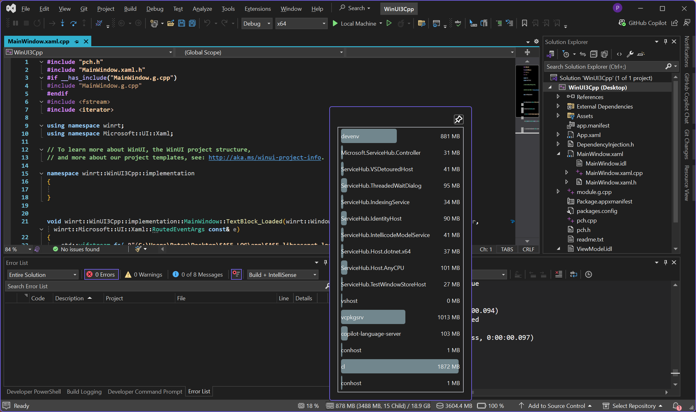
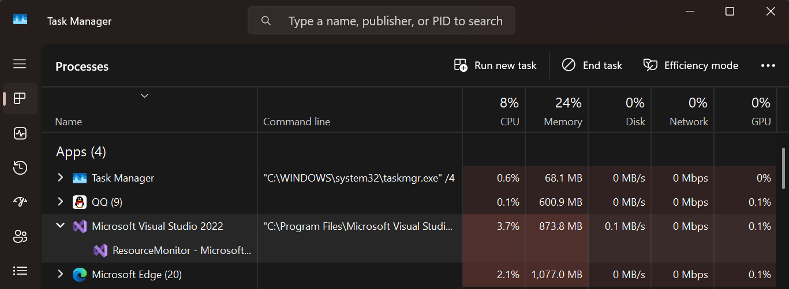
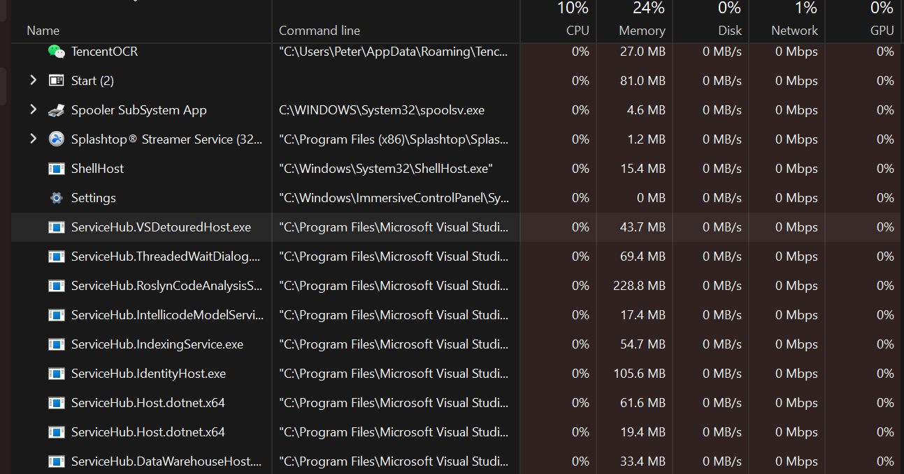

# ResourceMonitor
A Visual Studio extension for monitoring CPU, RAM, disk and Battery usage.

This extension supports:
- Visual Studio 2019
- Visual Studio 2022

## Download
For Visual Studio 2019 -> [Visual Studio Marketplace](https://marketplace.visualstudio.com/items?itemName=HO-COOH.ResourceMonitor)

For Visual Studio 2022 -> [Visual Studio Marketplace](https://marketplace.visualstudio.com/items?itemName=HO-COOH.ResourceMonitor2022)

## Features

- This extension adds hardware usage on the status bar of your Visual Studio. 

    

    left -> right: CPU, RAM, Disk, Battery

- The CPU and RAM section are clickable buttons, which opens up a panel of all the child processes (and their child, so it's recursive) and their hardware usages.

    

## Settings
You can found the settings in `Tools` -> `Options` -> `ResourceMonitor`

## Background
Windows 11 `taskmgr` does not correctly group child process created by Visual Studio. `taskmgr` shows currently it does not have any child process, which in reality, has many and all of them lying under background process.

## Plans
- ~~Add a setting menus for changing the refresh speed.~~ √ 
- ~~Add settings for displaying different things.~~ √ 
- ~~Able to run on start up~~ √ 
- ~~Visual Studio 2022 support~~ √

### Note:
Partially inspired by:
- https://github.com/lkytal/StatusInfo (RIP, not supporting VS2019)

*Visual studio are you drunk for occupying such precious screen-sapce just to show "Ready" and a notification bell?*
