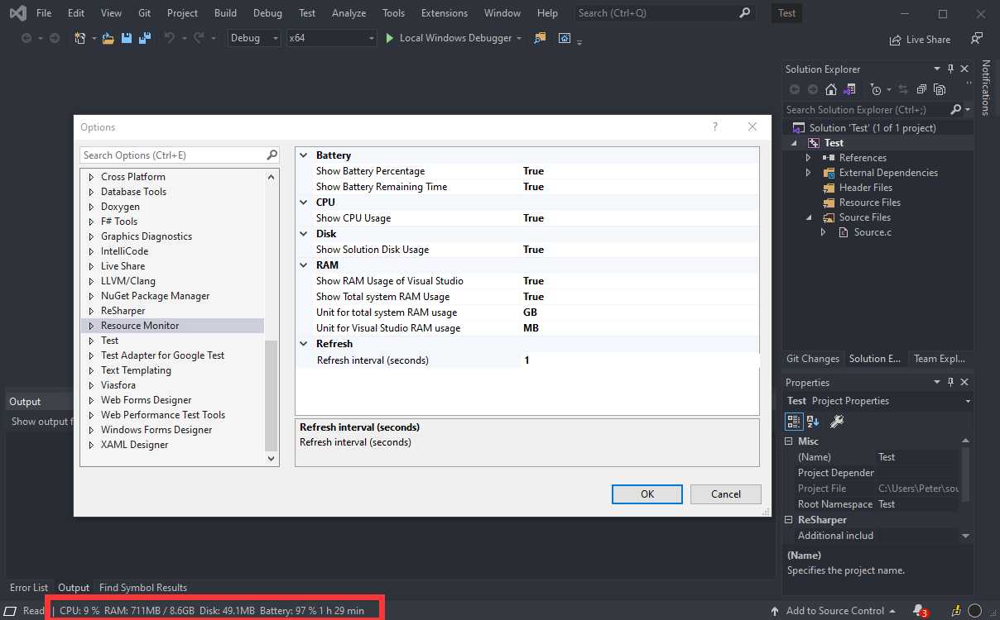
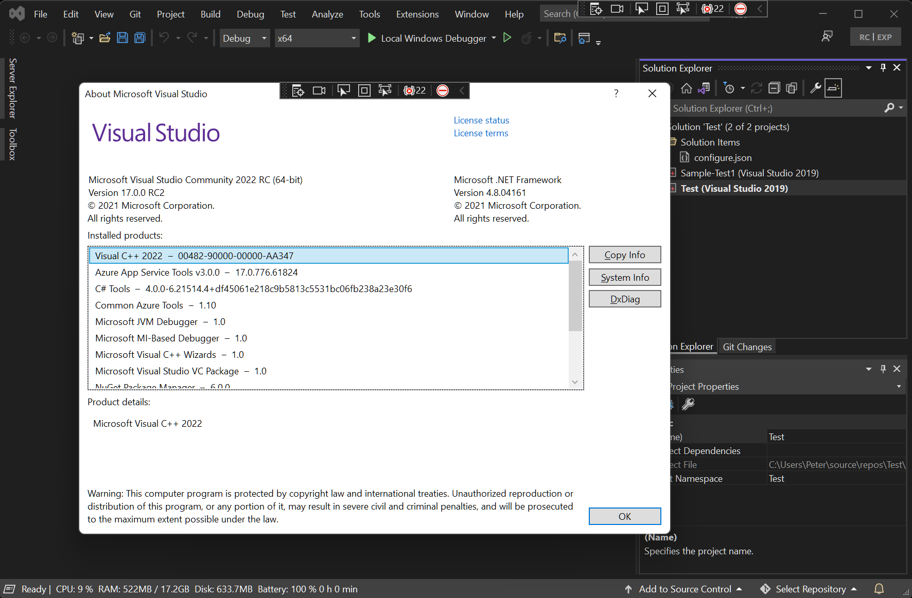

# ResourceMonitor
A Visual Studio extension for monitoring CPU, RAM, disk and Battery usage.

This extension supports:
- Visual Studio 2019
- Visual Studio 2022

## Download
For Visual Studio 2019 -> [Visual Studio Marketplace](https://marketplace.visualstudio.com/items?itemName=HO-COOH.ResourceMonitor)

For Visual Studio 2022 -> [Visual Studio Marketplace](https://marketplace.visualstudio.com/items?itemName=HO-COOH.ResourceMonitor2022)

## Usage
~~1. ``Tools`` -> ``Start Monitor``~~ No need. It automatically loads now :)

1. Now it will appear in the status bar.

Now supports Visual Studio 2022 too:

## Plans
- ~~Add a setting menus for changing the refresh speed.~~ √ 
- ~~Add settings for displaying different things.~~ √ 
- ~~Able to run on start up~~ √ 
- ~~Visual Studio 2022 support~~

### Note:
Partially inspired by:
- https://github.com/lkytal/StatusInfo (RIP, not supporting VS2019)

*Visual studio are you drunk for occupying such precious screen-sapce just to show "Ready" and a notification bell?*
